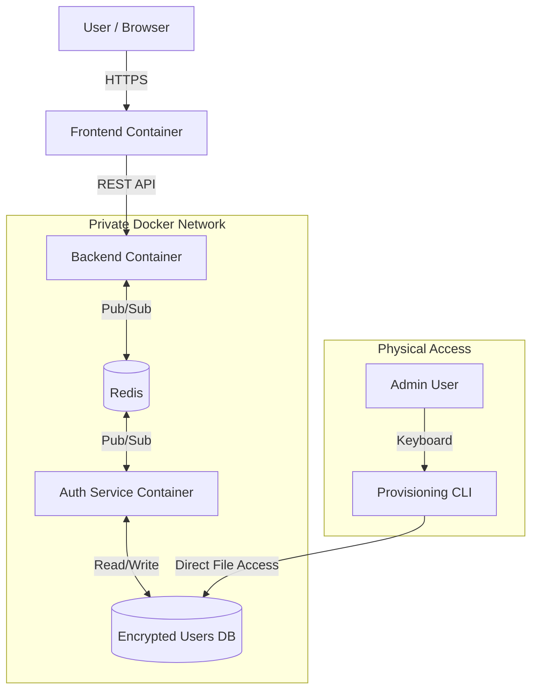
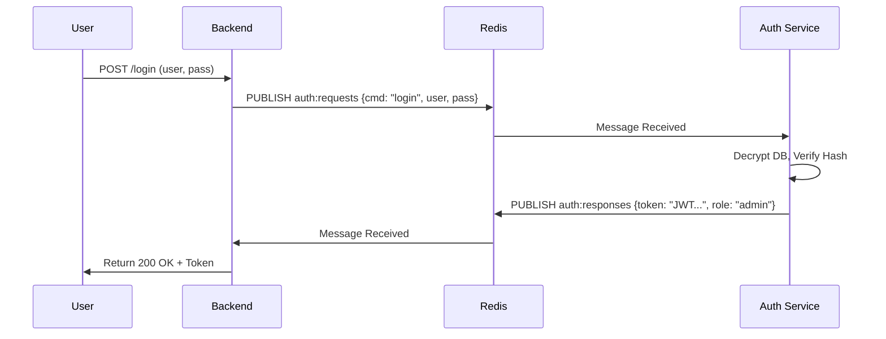
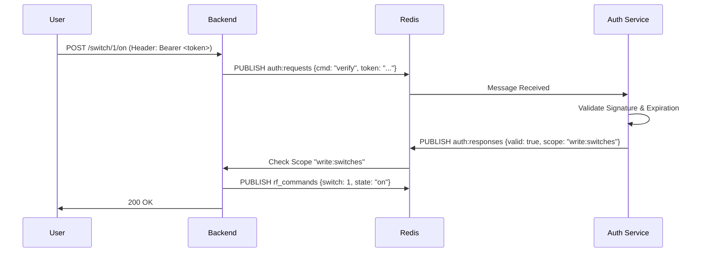
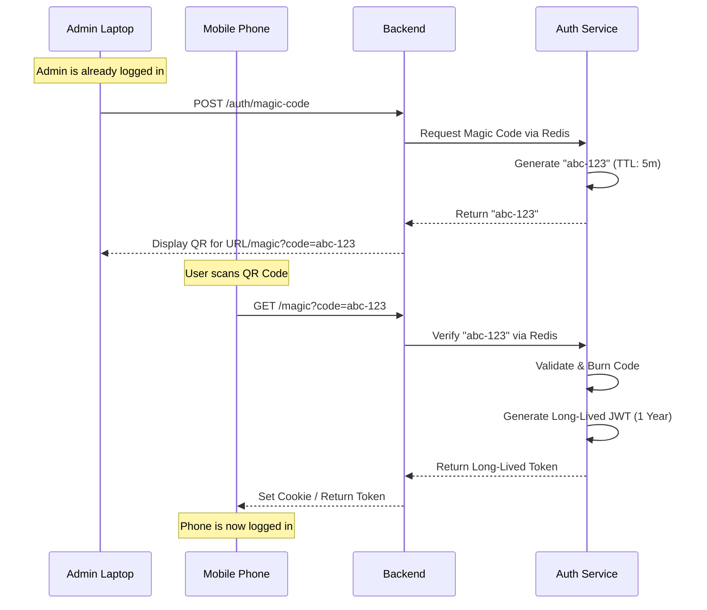

# CherryPi Secure Authentication System Design

## 1. Executive Summary
This document outlines the design for a secure, decoupled authentication system for CherryPi. The core philosophy is **isolation**: the Backend API acts as a gateway but delegates all security decisions to a dedicated **Auth Service** via Redis. This ensures the Backend remains stateless and never touches user credentials.

Key features include:
*   **Redis-based RPC**: Decoupled communication between Backend and Auth Service.
*   **Scoped JWTs**: Role-Based Access Control (RBAC) embedded in tokens.
*   **Magic QR Login**: Frictionless, secure onboarding for mobile devices.
*   **Encryption at Rest**: User database is encrypted on disk.
*   **Physical-Only Provisioning**: A CLI utility for user management that rejects remote (SSH) connections.

---

## 2. System Architecture

The system consists of three main components interacting over a private Docker network.



### Components
1.  **Backend (FastAPI)**:
    *   **Role**: Policy Enforcement Point (PEP).
    *   **Responsibility**: Intercepts requests, extracts tokens, asks Auth Service "Is this valid?", and enforces the answer.
    *   **Knowledge**: Knows *nothing* about passwords or user data.

2.  **Auth Service (Python)**:
    *   **Role**: Policy Decision Point (PDP) & Identity Provider.
    *   **Responsibility**: Validates credentials, mints JWTs, manages the "Magic Link" lifecycle, and handles encryption.
    *   **Storage**: Manages the encrypted `users.enc` file.

3.  **Redis**:
    *   **Role**: Message Bus.
    *   **Channels**: `auth:requests` (Login/Verify), `auth:responses` (Results).

---

## 3. Authentication Flows

### 3.1 Standard Login (Web)
User enters username/password. Backend forwards to Auth Service for verification.



### 3.2 Request Verification (API Protection)
Every protected action (e.g., turning on a switch) requires verification.



### 3.3 Magic QR Code Login (Mobile)
Securely transfer a session to a mobile device without typing passwords.



---

## 4. Security Features

### 4.1 Scoped JWTs & RBAC
Tokens will contain a `scope` claim to enforce permissions.
*   **Admin**: `scope: "read:all write:all admin:users"`
*   **Guest**: `scope: "read:switches"` (Can see status but not toggle)
*   **SwitchControl**: `scope: "read:switches write:switches"`

**Example Payload:**
```json
{
  "sub": "user_123",
  "role": "admin",
  "scope": "read:switches write:switches",
  "exp": 1735689600
}
```

### 4.2 Encryption at Rest
The user database (`users.json`) will never be stored in plain text.
*   **Implementation**: `Fernet` (symmetric encryption) from the `cryptography` library.
*   **Key Management**: The encryption key is stored in an environment variable `AUTH_DB_KEY` provided only to the Auth Service container.
*   **Process**: On startup, Auth Service reads `users.enc`, decrypts it into memory. On write, it encrypts and overwrites `users.enc`.

---

## 5. Identity Provisioning (Physical Access Only)

To prevent remote attackers from creating admin users even if they compromise the system, the provisioning tool will strictly enforce physical presence.

### The Utility: `secure_user_add.py`
A Python script located in the `auth_service` directory.

### Security Controls
1.  **TTY Check**: The script verifies it is running in a TTY.
2.  **SSH Detection**: The script checks for `SSH_CLIENT`, `SSH_TTY`, or `SSH_CONNECTION` environment variables. **If present, it aborts immediately.**
3.  **Root Requirement**: Must be run as root (to access the docker volume/file).

### Usage
You must plug a keyboard and monitor into the Raspberry Pi.
```bash
# 1. Login to the Pi physically
# 2. Run the utility
sudo python3 src/auth_service/secure_user_add.py

# Output:
# > Checking environment... Physical Console Detected ✅
# > Enter new username: admin
# > Enter password: *******
# > Select Role [admin/user]: admin
# > User 'admin' created successfully. Database encrypted.
```
